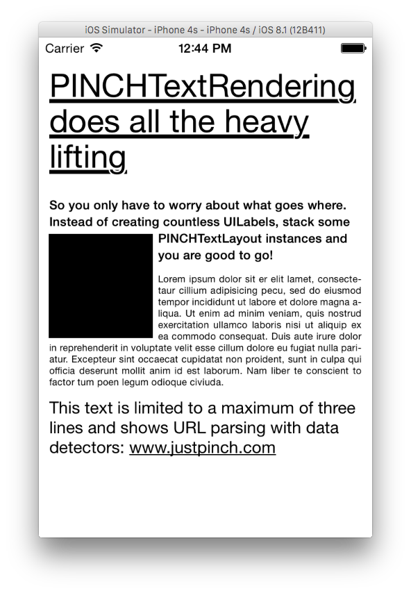
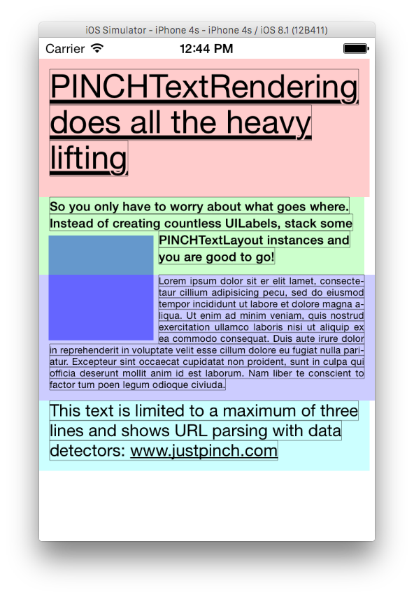

# PINCHTextRendering

**CoreText for the rest of us**


[](https://travis-ci.org/justpinch/PINCHTextRendering)
[](http://cocoadocs.org/docsets/PINCHTextRendering)
[](http://cocoadocs.org/docsets/PINCHTextRendering)
[](http://cocoadocs.org/docsets/PINCHTextRendering)

Simple CoreText abstraction layer inspired by TextKit. Stacks multiple strings on top of each other and shows them in a view or manually in a drawRect: implementation. Need to draw a lot of text (like for a certain watch?) this might come in handy.



Consisting of two main objects `PINCHTextLayout` and `PINCHTextRenderer`, this little framework should make it a lot easier to draw a stack of strings onto the screen, each with their own attributes. The framework adds some functionality needed for our own projects (like underline clipping) but is designed to be as generic as possible. As shown in the screenshot, wrapping the layouts around a rect is no problem as well.

The rendering of the layout objects can be done with `PINCHTextView`, the UILabel-like `PINCHTextLabel` or manually drawn in your drawRect: implementation. Setting `debugRendering` to `YES` in the textView shows where each layout and each seperate line is drawn:



## Usage

To run the example project, clone the repo, and run `pod install` from the Example directory first.

To get the most basic layout on screen, try the following

``` Objective-C
PINCHTextLayout *layout = [[PINCHTextLayout alloc] initWithString:@"Hello world!" attributes:@{PINCHTextLayoutFontAttribute: [UIFont systemFontOfSize:17]} name:@"hello"];
PINCHTextView *textView = [[PINCHTextView alloc] initWithFrame:self.view.bounds textLayouts:@[layout]];
[self.view addSubview:textView];
```

To draw the layout in a context (like from a drawRect:), the following might set you in the right path:

```Objective-C
PINCHTextRenderer *renderer = [[PINCHTextRenderer alloc] init];
renderer.textLayouts = @[layout];
[renderer renderTextLayoutsInContext:context withRect:rect];
```

Adding a rect to wrap the layouts around is not a problem at all

```Objective-C
CGRect clipRect = CGRectMake(10, 50, 100, 100);
self.textView.renderer.clippingRect = clipRect;
```

In the provided example app, tapping the screen and moving the touch around adds a clipping rect to the textView.

The `PINCHTextRenderer` instance will update you with its progress via the `PINCHTextRendererDelegate` protocol. This enables you to draw additional graphics behind, over, or around the rendered layouts. With the delegate method described below it should for example be possible to draw a container behind the layouts:

```Objective-C
- (void)textRenderer:(PINCHTextRenderer *)textRenderer willRenderTextLayouts:(NSArray *)textLayouts inBoundingRect:(CGRect)rect withContext:(CGContextRef)context;
```

## Requirements

PINCHTextRendering should work on iOS 6 and above, though iOS 5 support might be possible if all NSAttributedString attributes are replaced by their CoreText counterparts. This didn't seem necessary at the time of creating.

## Installation

PINCHTextRendering is available through [CocoaPods](http://cocoapods.org). To install
it, simply add the following line to your Podfile:

    pod "PINCHTextRendering"

Adding the following import to your files gives you access to the most used classes
``` Objective-C
#import <PINCHTextRendering/PINCHTextRendering.h>
```

## Author

Pim Coumans, pim.coumans@justpinch.com

## License

PINCHTextRendering is available under the MIT license. See the LICENSE file for more info.
